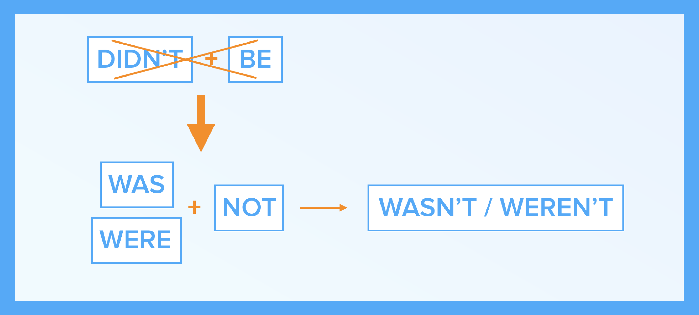

#Didn’t, wasn’t and weren’t

##“Women didn’t wear jeans. Telephones weren’t private.”

What inventions did people begin using in the 1950s? 

In this unit you will: 
- learn some interesting facts about the 1950s
- practice using <b>didn’t</b> and <b>wasn’t</b>

<iframe src="https://h5p.org/h5p/embed/264598" width="1090" height="675" frameborder="0" allowfullscreen="allowfullscreen"></iframe>

### Materials

  <!-- Nav tabs -->
  <ul class="nav nav-tabs" role="tablist">
    <li role="presentation" class="active"><a href="#home" aria-controls="home" role="tab" data-toggle="tab">Table 1</a></li>
    <li role="presentation"><a href="#menu41" aria-controls="menu41" role="tab" data-toggle="tab">Table 2</a></li>
  </ul>
  <!-- Tab panes -->
  

    

</img>
    

    

</img>
  

## Activities

  <!-- Nav tabs -->
  <ul class="nav nav-tabs" role="tablist">
    <li role="presentation" class="active"><a href="#home2" aria-controls="home2" role="tab" data-toggle="tab">Task 1</a></li>
    <li role="presentation"><a href="#menu51" aria-controls="menu51" role="tab" data-toggle="tab">Task 2</a></li>
  </ul>
  <!-- Tab panes -->
  

    

<iframe src="https://learningapps.org/watch?v=p1dbjeowj18" style="border:0px;width:100%;height:1200px" webkitallowfullscreen="true" mozallowfullscreen="true"></iframe>
    

    

<iframe src="https://learningapps.org/watch?v=p7z6pox9318" style="border:0px;width:100%;height:1000px" webkitallowfullscreen="true" mozallowfullscreen="true"></iframe>
  

    
Будьте першими хто дізнається про запуск нових спецпроектів EdEra з вивчення англійської мови. Вкажіть свій e-mail у формі й слідкуйте за оновленнями.

  

  <form id="mc-embedded-subscribe-form" action="//ed-era.us11.list-manage.com/subscribe/post?u=8866dd2b60d24631dfb05130e&amp;amp;id=7c924ccd0e" method="post" name="mc-embedded-subscribe-form" novalidate="novalidate" target="_blank" class="validate">
   

    

      <input id="mce-EMAIL" name="EMAIL" type="email" value="" class="required email col-xs-5 col-sm-5 col-md-5 col-lg-5 col-lg-offset-1 col-xs-offset-1 col-sm-offset-1 col-md-offset-1" aria-required="true">
      <button id="mc-embedded-subscribe" name="subscribe" type="button" class="btn btn-primary" style="margin-left: 15px">Слідкувати за новинами</button>
     </label>
    

   

  </form>
  

   

   

  

  <!-- real people should not fill this in and expect good things - do not remove this or risk form bot signups-->
  

   <input name="b_f0d231561f25f732145baed3d_ba0b4591d2" tabindex="-1" type="text" value="">
  

  
  

