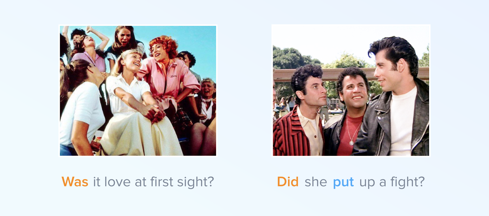

#Was/Were/Did questions

##“Was it love at first sight?”

Was it love at first sight? 

In this video you will:
- listen to a song from the film “Grease”
- look at the difference between <b>was</b> and <b>did</b> questions

<iframe src="https://h5p.org/h5p/embed/264555" width="1090" height="674" frameborder="0" allowfullscreen="allowfullscreen"></iframe>

### Materials

### Exercise

  <!-- Nav tabs -->
  <ul class="nav nav-tabs" role="tablist">
    <li role="presentation" class="active"><a href="#home" aria-controls="home" role="tab" data-toggle="tab">Task 1</a></li>
  </ul>
  <!-- Tab panes -->
  

    

<iframe src="https://learningapps.org/watch?v=pff6dsg8318" style="border:0px;width:100%;height:500px" webkitallowfullscreen="true" mozallowfullscreen="true"></iframe>
    

