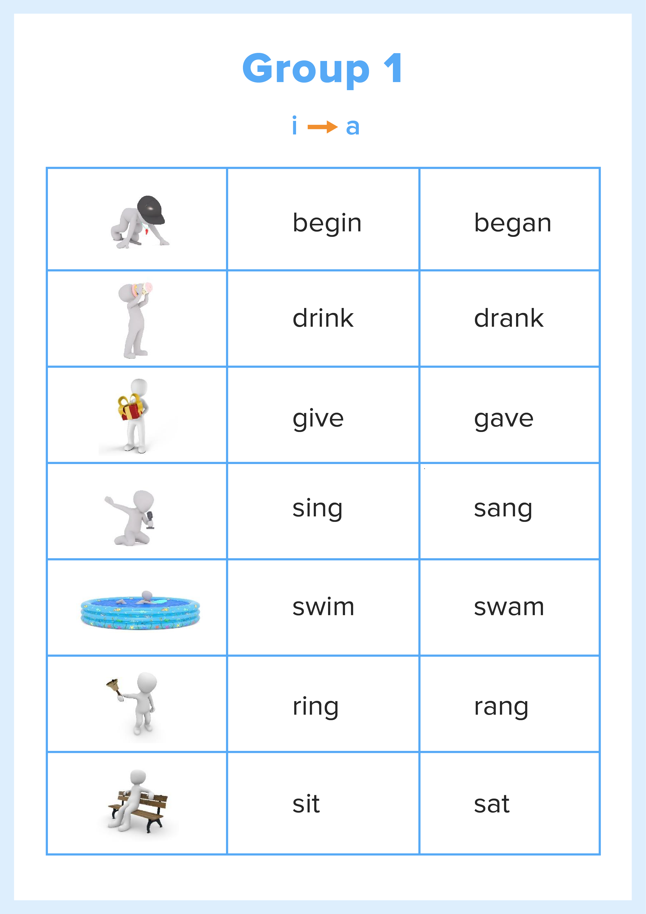
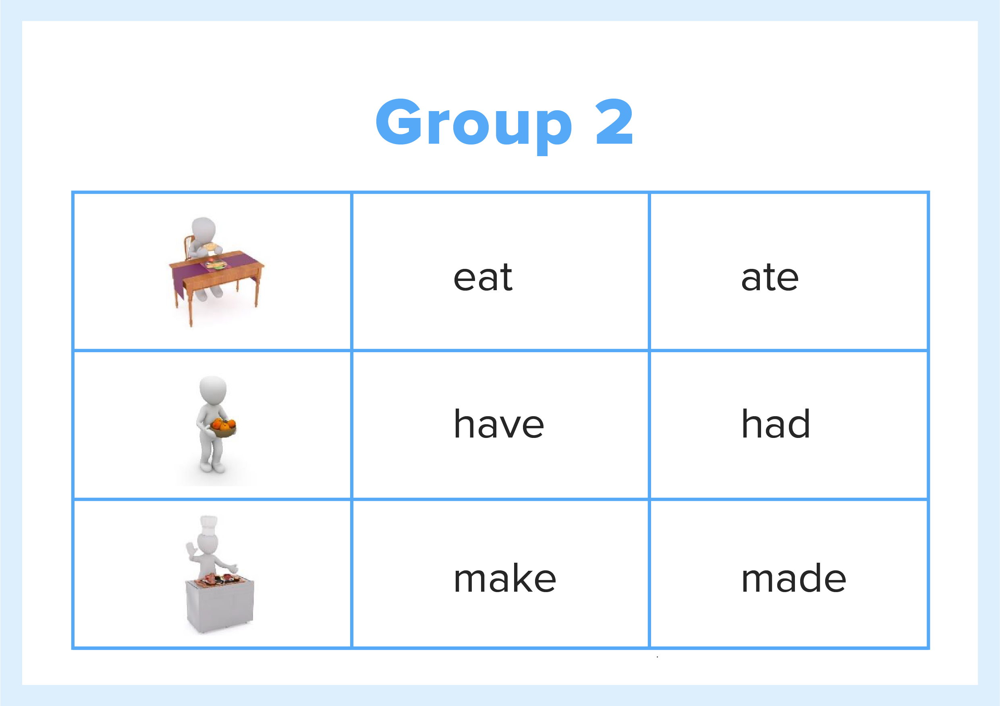
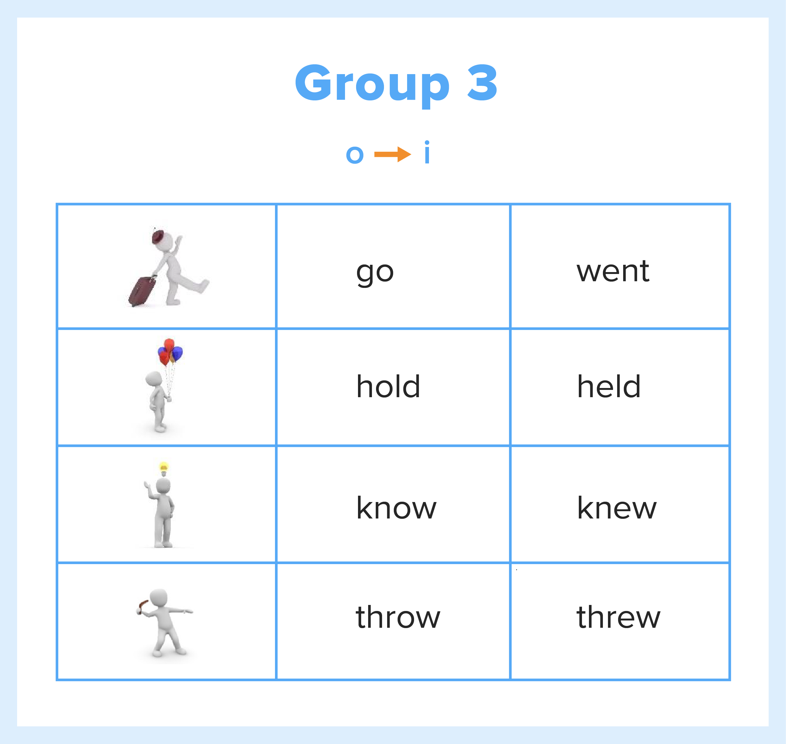
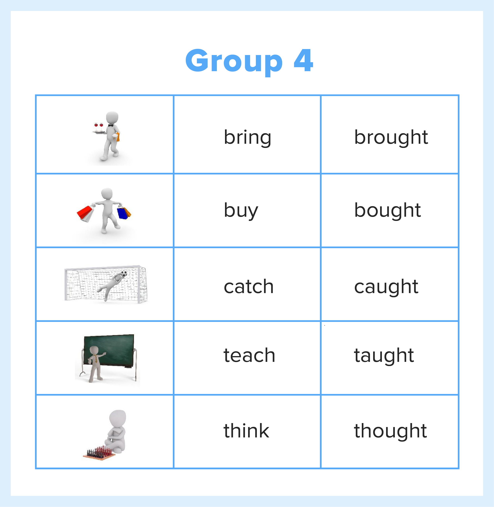
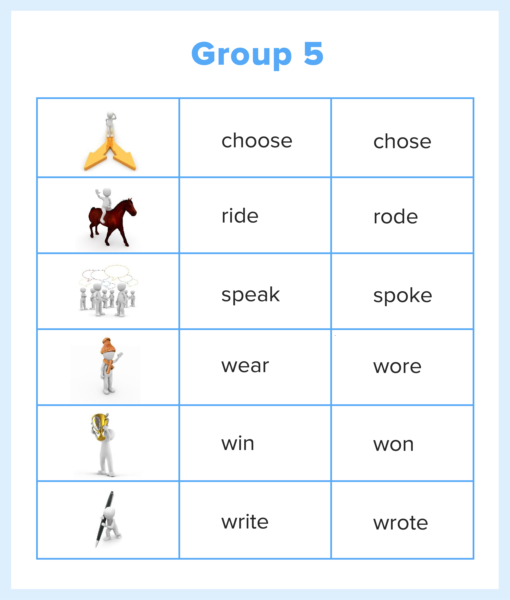
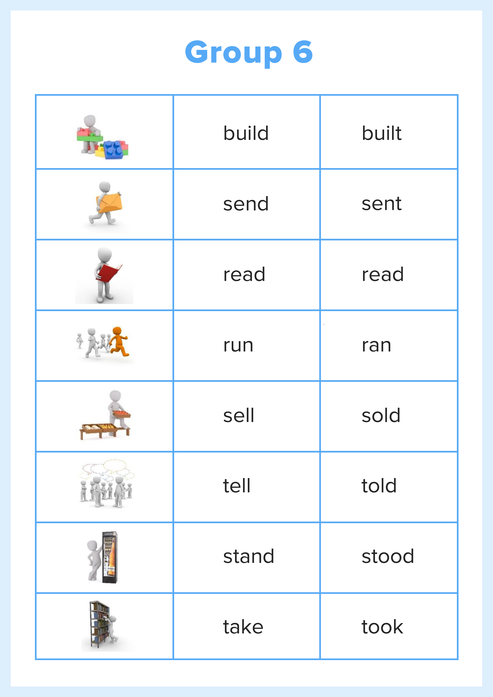

#Learn irregular verbs!

Here are materials and activities - everything you need to learn important irregular verbs!

  <!-- Nav tabs -->
  <ul class="nav nav-tabs" role="tablist">
    <li role="presentation" class="active"><a href="#home" aria-controls="home" role="tab" data-toggle="tab">Group 1</a></li>
    <li role="presentation"><a href="#menu1" aria-controls="menu1" role="tab" data-toggle="tab">Group 2-3</a></li>
    <li role="presentation"><a href="#menu2" aria-controls="menu2" role="tab" data-toggle="tab">Group 4</a></li>
    <li role="presentation"><a href="#menu3" aria-controls="menu3" role="tab" data-toggle="tab">Group 5</a></li>
    <li role="presentation"><a href="#menu4" aria-controls="menu4" role="tab" data-toggle="tab">Group 6</a></li>
  </ul>
  <!-- Tab panes -->
  

    

</img>

<a href="https://quizlet.com/302567712/write" target="_blank"><button type="button" class="btn btn-primary" aria-haspopup="true" aria-expanded="false">Activity 1</button></a>

    

    

</img>
</img>

<a href="https://quizlet.com/302581153/write" target="_blank"><button type="button" class="btn btn-primary" aria-haspopup="true" aria-expanded="false">Activity 2-3</button></a>

  

    

</img>

<a href="https://quizlet.com/302588327/write" target="_blank"><button type="button" class="btn btn-primary" aria-haspopup="true" aria-expanded="false">Activity 4</button></a>

  

    

</img>

<a href="https://quizlet.com/302589457/write" target="_blank"><button type="button" class="btn btn-primary" aria-haspopup="true" aria-expanded="false">Activity 5</button></a>

  

    

</img>

<a href="https://quizlet.com/302591717/write" target="_blank"><button type="button" class="btn btn-primary" aria-haspopup="true" aria-expanded="false">Activity 6</button></a>

  

