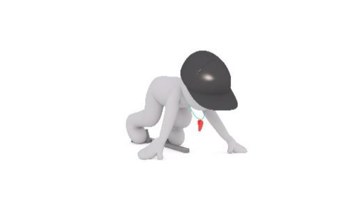
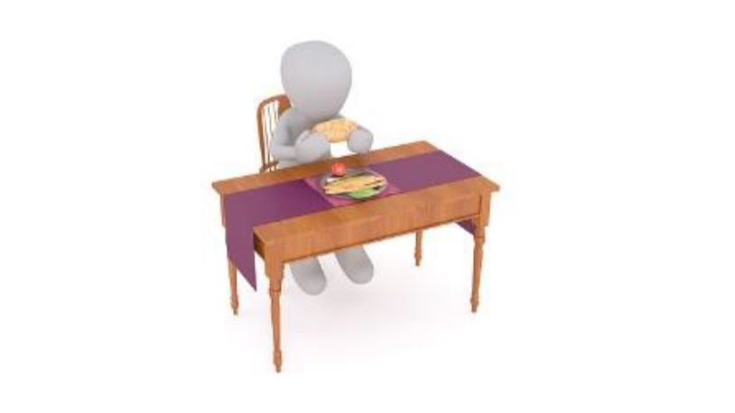
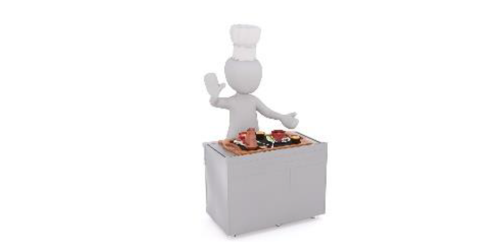
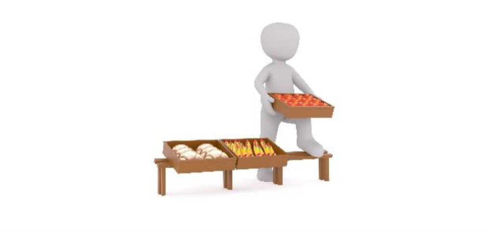
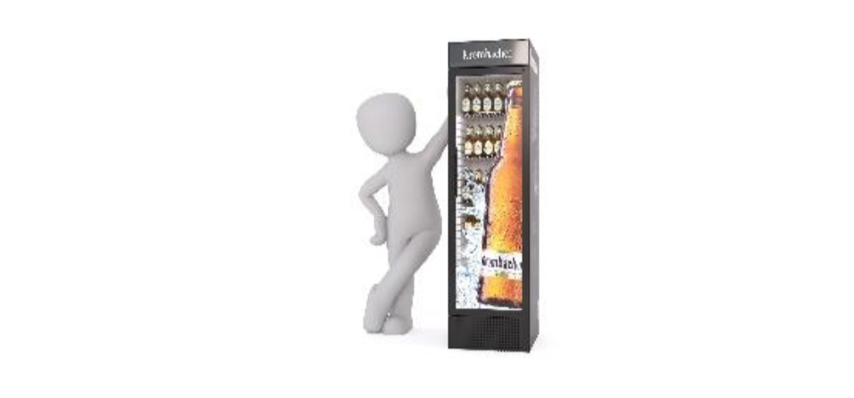

#Learn irregular verbs!

Here are materials and activities – everything you need to learn important irregular verbs!

  <!-- Nav tabs -->
  <ul class="nav nav-tabs" role="tablist">
    <li role="presentation" class="active"><a href="#home" aria-controls="home" role="tab" data-toggle="tab">Group 1</a></li>
    <li role="presentation"><a href="#menu1" aria-controls="menu1" role="tab" data-toggle="tab">Group 2-3</a></li>
    <li role="presentation"><a href="#menu2" aria-controls="menu2" role="tab" data-toggle="tab">Group 4</a></li>
    <li role="presentation"><a href="#menu3" aria-controls="menu3" role="tab" data-toggle="tab">Group 5</a></li>
    <li role="presentation"><a href="#menu4" aria-controls="menu4" role="tab" data-toggle="tab">Group 6</a></li>
  </ul>
  <!-- Tab panes -->
  

    

 i &rArr; a
 
<table>
  <tr>
    <td width="35%" valign="top" style="background: white;">
    </img>
    </td>
    <td width="32%" valign="middle"  align="center" style="font-size: 140%!important; background: white;">
      beg<b>i</b>n
    </td>
    <td width="32%" valign="middle" align="center" style="font-size: 140%!important; background: white;">
    beg<b>a</b>n
    </td>
  </tr>
      <tr>
    <td width="35%" valign="top" style="background: white;">
    </img>
    </td>
    <td width="32%" valign="middle" align="center" style="font-size: 140%!important; background: white;">
      dr<b>i</b>nk
    </td>
    <td width="32%" valign="middle" align="center" style="font-size: 140%!important; background: white;">
    dr<b>a</b>nk
    </td>
  </tr>
          <tr>
    <td width="35%" valign="top" style="background: white;">
    </img>
    </td>
    <td width="32%" valign="middle" align="center" style="font-size: 140%!important; background: white;">
      g<b>i</b>ve
    </td>
    <td width="32%" valign="middle" align="center" style="font-size: 140%!important; background: white;">
    g<b>a</b>ve 
    </td>
  </tr>
                            <tr>
    <td width="35%" valign="top" style="background: white;">
    </img>
    </td>
    <td width="32%" valign="middle" align="center" style="font-size: 140%!important; background: white;">
      s<b>i</b>ng
    </td>
    <td width="32%" valign="middle" align="center" style="font-size: 140%!important; background: white;">
    s<b>a</b>ng 
    </td>
  </tr>
  <tr>
    <td width="35%" valign="top" style="background: white;">
    </img>
    </td>
    <td width="32%" valign="middle" align="center" style="font-size: 140%!important; background: white;">
      sw<b>i</b>m
    </td>
    <td width="32%" valign="middle" align="center" style="font-size: 140%!important; background: white;">
    sw<b>a</b>m 
    </td>
  </tr>
                            <tr>
    <td width="35%" valign="top" style="background: white;">
    </img>
    </td>
    <td width="32%" valign="middle" align="center" style="font-size: 140%!important; background: white;">
      r<b>i</b>ng
    </td>
    <td width="32%" valign="middle" align="center" style="font-size: 140%!important; background: white;">
    r<b>a</b>ng 
    </td>
  </tr>
                            <tr>
    <td width="35%" valign="top" style="background: white;">
    </img>
    </td>
    <td width="32%" valign="middle" align="center" style="font-size: 140%!important; background: white;">
      s<b>i</b>t
    </td>
    <td width="32%" valign="middle" align="center" style="font-size: 140%!important; background: white;">
    s<b>a</b>t 
    </td>
  </tr>
  </table>

<a href="https://quizlet.com/302567712/write" target="_blank"><button type="button" class="btn btn-primary btn-lg">Activity 1</button></a>

    

    

  <table>
      <tr>
    <td width="35%" valign="top" style="background: white;">
    </img>
    </td>
    <td width="32%" valign="middle" align="center" style="font-size: 140%!important; background: white;">
      eat
    </td>
    <td width="32%" valign="middle" align="center" style="font-size: 140%!important; background: white;">
    ate
    </td>
  </tr>
              <tr>
    <td width="35%" valign="top" style="background: white;">
    </img>
    </td>
    <td width="32%" valign="middle" align="center" style="font-size: 140%!important; background: white;">
      have
    </td>
    <td width="32%" valign="middle" align="center" style="font-size: 140%!important; background: white;">
    had 
    </td>
  </tr>
                    <tr>
    <td width="35%" valign="top" style="background: white;">
    </img>
    </td>
    <td width="32%" valign="middle" align="center" style="font-size: 140%!important; background: white;">
      make
    </td>
    <td width="32%" valign="middle" align="center" style="font-size: 140%!important; background: white;">
    made 
    </td>
  </tr>
    </table>

 o &rArr; e
 
    <table>
                <tr>
    <td width="35%" valign="top" style="background: white;">
    </img>
    </td>
    <td width="32%" valign="middle" align="center" style="font-size: 140%!important; background: white;">
      g<b>o</b>
    </td>
    <td width="32%" valign="middle" align="center" style="font-size: 140%!important; background: white;">
    w<b>e</b>nt 
    </td>
  </tr>
                <tr>
    <td width="35%" valign="top" style="background: white;">
    </img>
    </td>
    <td width="32%" valign="middle" align="center" style="font-size: 140%!important; background: white;">
      h<b>o</b>ld
    </td>
    <td width="32%" valign="middle" align="center" style="font-size: 140%!important; background: white;">
    h<b>e</b>ld 
    </td>
  </tr>
                  <tr>
    <td width="35%" valign="top" style="background: white;">
    </img>
    </td>
    <td width="32%" valign="middle" align="center" style="font-size: 140%!important; background: white;">
      kn<b>o</b>w
    </td>
    <td width="32%" valign="middle" align="center" style="font-size: 140%!important; background: white;">
    kn<b>e</b>w 
    </td>
  </tr>
  <tr>
    <td width="35%" valign="top" style="background: white;">
    </img>
    </td>
    <td width="32%" valign="middle" align="center" style="font-size: 140%!important; background: white;">
      thr<b>o</b>w
    </td>
    <td width="32%" valign="middle" align="center" style="font-size: 140%!important; background: white;">
    thr<b>e</b>w 
    </td>
  </tr>
        </table>

<a href="https://quizlet.com/302581153/write" target="_blank"><button type="button" class="btn btn-primary btn-lg">Activity 2-3</button></a>

  

    

       <table>
          <tr>
    <td width="35%" valign="top" style="background: white;">
    </img>
    </td>
    <td width="32%" valign="middle"  align="center" style="font-size: 140%!important; background: white;">
      bring
    </td>
    <td width="32%" valign="middle" align="center" style="font-size: 140%!important; background: white;">
    brought
    </td>
  </tr>
    <tr>
    <td width="35%" valign="top" style="background: white;">
    </img>
    </td>
    <td width="32%" valign="middle" align="center" style="font-size: 140%!important; background: white;">
      buy
    </td>
    <td width="32%" valign="middle" align="center" style="font-size: 140%!important; background: white;">
    bought
    </td>
  </tr>
    <tr>
    <td width="35%" valign="top" style="background: white;">
    </img>
    </td>
    <td width="32%" valign="middle" align="center" style="font-size: 140%!important; background: white;">
      catch
    </td>
    <td width="32%" valign="middle" align="center" style="font-size: 140%!important; background: white;">
    caught
    </td>
  </tr>
  <tr>
    <td width="35%" valign="top" style="background: white;">
    </img>
    </td>
    <td width="32%" valign="middle" align="center" style="font-size: 140%!important; background: white;">
      teach
    </td>
    <td width="32%" valign="middle" align="center" style="font-size: 140%!important; background: white;">
    taught 
    </td>
  </tr>
  <tr>
    <td width="35%" valign="top" style="background: white;">
    </img>
    </td>
    <td width="32%" valign="middle" align="center" style="font-size: 140%!important; background: white;">
      think
    </td>
    <td width="32%" valign="middle" align="center" style="font-size: 140%!important; background: white;">
    thought 
    </td>
  </tr>
              </table>

<a href="https://quizlet.com/302588327/write" target="_blank"><button type="button" class="btn btn-primary btn-lg">Activity 4</button></a>

  

    

<table>
    <tr>
    <td width="35%" valign="top" style="background: white;">
    </img>
    </td>
    <td width="32%" valign="middle" align="center" style="font-size: 140%!important; background: white;">
      choose
    </td>
    <td width="32%" valign="middle" align="center" style="font-size: 140%!important; background: white;">
    chose
    </td>
  </tr>
                        <tr>
    <td width="35%" valign="top" style="background: white;">
    </img>
    </td>
    <td width="32%" valign="middle" align="center" style="font-size: 140%!important; background: white;">
      ride
    </td>
    <td width="32%" valign="middle" align="center" style="font-size: 140%!important; background: white;">
    rode 
    </td>
  </tr>
  <tr>
    <td width="35%" valign="top" style="background: white;">
    </img>
    </td>
    <td width="32%" valign="middle" align="center" style="font-size: 140%!important; background: white;">
      speak
    </td>
    <td width="32%" valign="middle" align="center" style="font-size: 140%!important; background: white;">
    spoke 
    </td>
  </tr>
  <tr>
    <td width="35%" valign="top" style="background: white;">
    </img>
    </td>
    <td width="32%" valign="middle" align="center" style="font-size: 140%!important; background: white;">
      wear
    </td>
    <td width="32%" valign="middle" align="center" style="font-size: 140%!important; background: white;">
    wore 
    </td>
  </tr>
  <tr>
    <td width="35%" valign="top" style="background: white;">
    </img>
    </td>
    <td width="32%" valign="middle" align="center" style="font-size: 140%!important; background: white;">
      win
    </td>
    <td width="32%" valign="middle" align="center" style="font-size: 140%!important; background: white;">
    won 
    </td>
  </tr>
  <tr>
    <td width="35%" valign="top" style="background: white;">
    </img>
    </td>
    <td width="32%" valign="middle" align="center" style="font-size: 140%!important; background: white;">
      write
    </td>
    <td width="32%" valign="middle" align="center" style="font-size: 140%!important; background: white;">
    wrote 
    </td>
  </tr>
  </table>

<a href="https://quizlet.com/302589457/write" target="_blank"><button type="button" class="btn btn-primary btn-lg">Activity 5</button></a>

  

    

  <table>
      <tr>
    <td width="35%" valign="top" style="background: white;">
    </img>
    </td>
    <td width="32%" valign="middle" align="center" style="font-size: 140%!important; background: white;">
      build
    </td>
    <td width="32%" valign="middle" align="center" style="font-size: 140%!important; background: white;">
    built
    </td>
  </tr>
                            <tr>
    <td width="35%" valign="top" style="background: white;">
    </img>
    </td>
    <td width="32%" valign="middle" align="center" style="font-size: 140%!important; background: white;">
      send
    </td>
    <td width="32%" valign="middle" align="center" style="font-size: 140%!important; background: white;">
    sent 
    </td>
                          <tr>
    <td width="35%" valign="top" style="background: white;">
    </img>
    </td>
    <td width="32%" valign="middle" align="center" style="font-size: 140%!important; background: white;">
      read
    </td>
    <td width="32%" valign="middle" align="center" style="font-size: 140%!important; background: white;">
    read 
    </td>
  </tr>
                            <tr>
    <td width="35%" valign="top" style="background: white;">
    </img>
    </td>
    <td width="32%" valign="middle" align="center" style="font-size: 140%!important; background: white;">
      run
    </td>
    <td width="32%" valign="middle" align="center" style="font-size: 140%!important; background: white;">
    ran 
    </td>
  </tr>
                            <tr>
    <td width="35%" valign="top" style="background: white;">
    </img>
    </td>
    <td width="32%" valign="middle" align="center" style="font-size: 140%!important; background: white;">
      sell
    </td>
    <td width="32%" valign="middle" align="center" style="font-size: 140%!important; background: white;">
    sold 
    </td>
  </tr>
                              <tr>
    <td width="35%" valign="top" style="background: white;">
    </img>
    </td>
    <td width="32%" valign="middle" align="center" style="font-size: 140%!important; background: white;">
      tell
    </td>
    <td width="32%" valign="middle" align="center" style="font-size: 140%!important; background: white;">
    told 
    </td>
  </tr>
  <tr>
    <td width="35%" valign="top" style="background: white;">
    </img>
    </td>
    <td width="32%" valign="middle" align="center" style="font-size: 140%!important; background: white;">
      stand
    </td>
    <td width="32%" valign="middle" align="center" style="font-size: 140%!important; background: white;">
    stood 
    </td>
  </tr>
  <tr>
    <td width="35%" valign="top" style="background: white;">
    </img>
    </td>
    <td width="32%" valign="middle" align="center" style="font-size: 140%!important; background: white;">
      take
    </td>
    <td width="32%" valign="middle" align="center" style="font-size: 140%!important; background: white;">
    took 
    </td>
  </tr>
    </table>

<a href="https://quizlet.com/302591717/write" target="_blank"><button type="button" class="btn btn-primary btn-lg">Activity 6</button></a>

  

