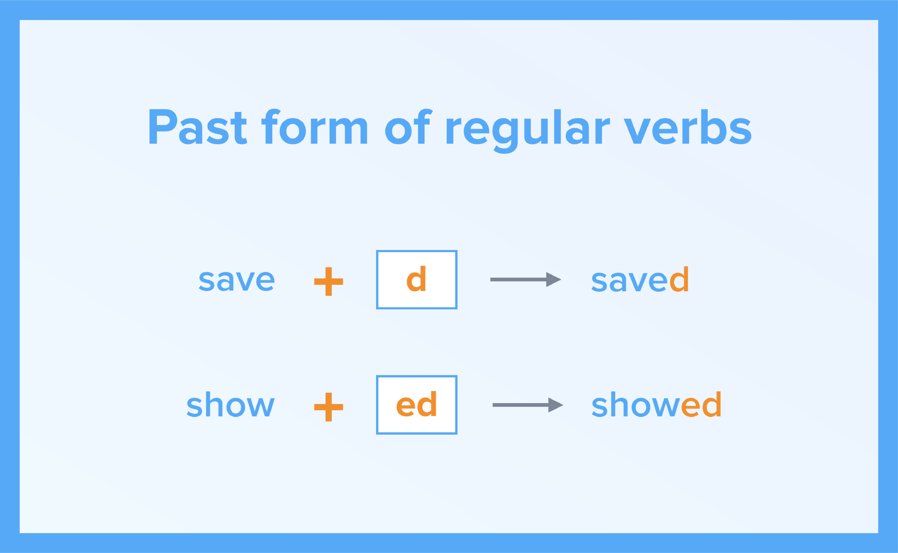

#Regular verbs

##“He danced. She studied”

How did Danny and Sandy meet? 

In this unit you will:
- listen to a song from the film “Grease”
- learn the past form of regular verbs.

<iframe src="https://h5p.org/h5p/embed/265195" width="1090" height="675" frameborder="0" allowfullscreen="allowfullscreen"></iframe>

### Materials

 

### Activities

  <!-- Nav tabs -->
  <ul class="nav nav-tabs" role="tablist">
    <li role="presentation" class="active"><a href="#home" aria-controls="home" role="tab" data-toggle="tab">Bonus video- activity</a></li>
  </ul>
  <!-- Tab panes -->
  

    

<iframe src="https://h5p.org/h5p/embed/264529" width="1090" height="674" frameborder="0" allowfullscreen="allowfullscreen"></iframe>
    

 
 

  <!-- Nav tabs -->
  <ul class="nav nav-tabs" role="tablist">
    <li role="presentation" class="active"><a href="#home" aria-controls="home" role="tab" data-toggle="tab">Task 1</a></li>
  </ul>
  <!-- Tab panes -->
  

    

<iframe src="https://learningapps.org/watch?v=po9czroh318" style="border:0px;width:100%;height:500px" webkitallowfullscreen="true" mozallowfullscreen="true"></iframe>
    

 
 

  <!-- Nav tabs -->
  <ul class="nav nav-tabs" role="tablist">
    <li role="presentation" class="active"><a href="#menu1" aria-controls="menu1" role="tab" data-toggle="tab">Task 2</a></li>
  </ul>
  <!-- Tab panes -->
  

    

<iframe src="https://learningapps.org/watch?v=pzp0j8yn318" style="border:0px;width:100%;height:500px" webkitallowfullscreen="true" mozallowfullscreen="true"></iframe>
  

