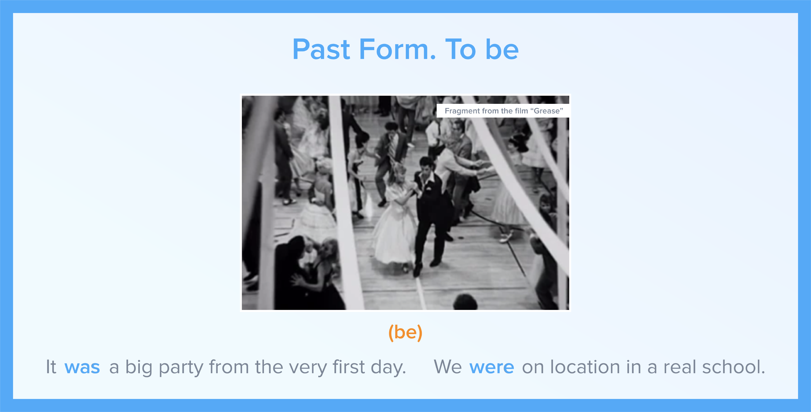
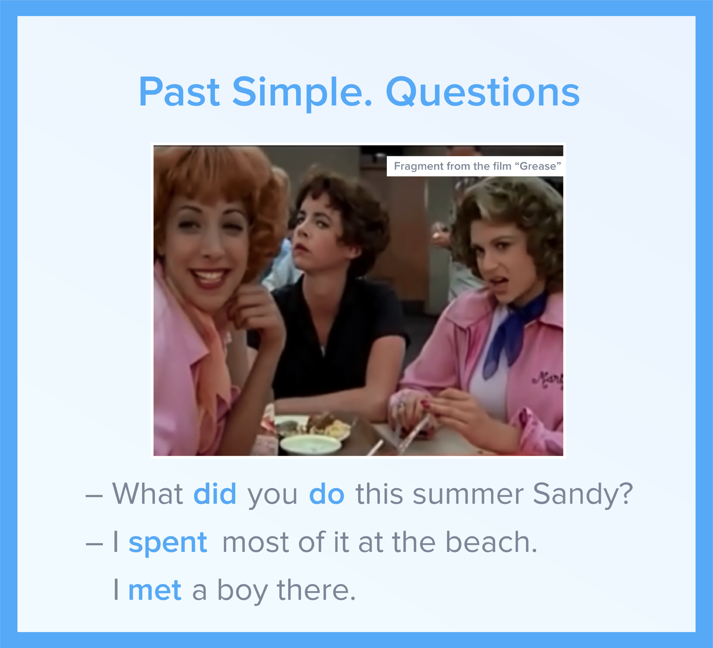

#Past Simple summary

##The Making of “Grease”

What do the actors from “Grease” say about the film? 

In this video you will:
- listen to their  memories and experiences from making the film 
- check  how much you’ve learnt about Past Simpl

  <iframe class="embed-responsive-item" src="https://www.youtube.com/embed/yjCVgaGfg1w" allowfullscreen></iframe>

### Materials

  <!-- Nav tabs -->
  <ul class="nav nav-tabs" role="tablist">
    <li role="presentation" class="active"><a href="#home" aria-controls="home" role="tab" data-toggle="tab">Materials 1</a></li>
    <li role="presentation"><a href="#menu22" aria-controls="menu22" role="tab" data-toggle="tab">Materials 2</a></li>
    <li role="presentation"><a href="#menu23" aria-controls="menu23" role="tab" data-toggle="tab">Materials 3</a></li>
    <li role="presentation"><a href="#menu24" aria-controls="menu24" role="tab" data-toggle="tab">Materials 4</a></li>
    <li role="presentation"><a href="#menu25" aria-controls="menu25" role="tab" data-toggle="tab">Materials 5</a></li>
    <li role="presentation"><a href="#menu26" aria-controls="menu26" role="tab" data-toggle="tab">Materials 6</a></li>
    <li role="presentation"><a href="#menu27" aria-controls="menu27" role="tab" data-toggle="tab">Materials 7</a></li>
  </ul>
  <!-- Tab panes -->
  

    

  

    

  

    

  

      

  

        

  

        

  

          

  

### Activities

  <!-- Nav tabs -->
  <ul class="nav nav-tabs" role="tablist">
    <li role="presentation" class="active"><a href="#home2" aria-controls="home2" role="tab" data-toggle="tab">Task 1</a></li>
    <li role="presentation"><a href="#menu1" aria-controls="menu1" role="tab" data-toggle="tab">Task 2</a></li>
  </ul>
  <!-- Tab panes -->
  

    

<iframe src="https://learningapps.org/watch?v=p22hstdmn18" style="border:0px;width:100%;height:500px" webkitallowfullscreen="true" mozallowfullscreen="true"></iframe>
    

    

<iframe src="https://learningapps.org/watch?v=pcxkppq5v18" style="border:0px;width:100%;height:500px" webkitallowfullscreen="true" mozallowfullscreen="true"></iframe>
  

  

  
