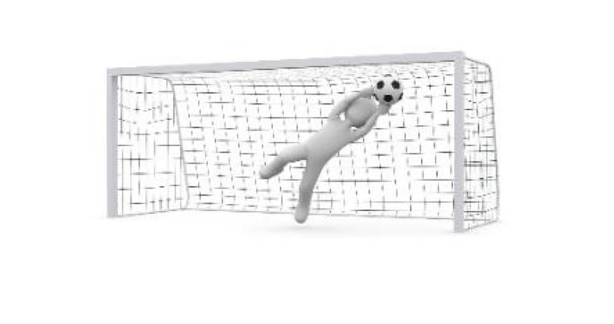
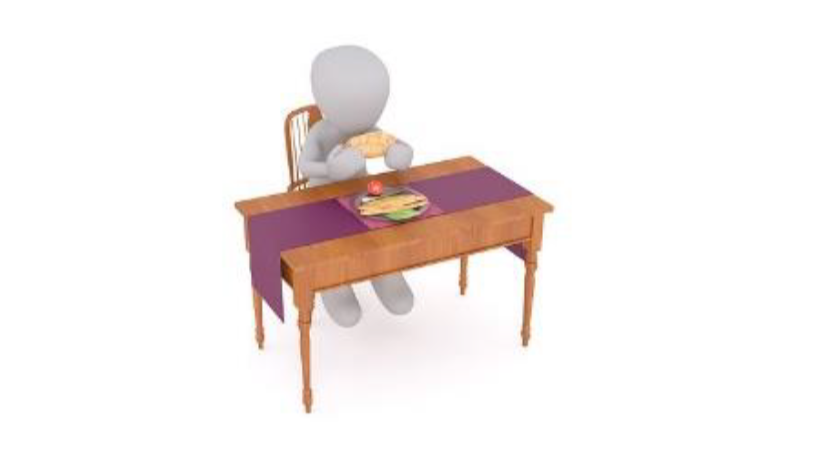
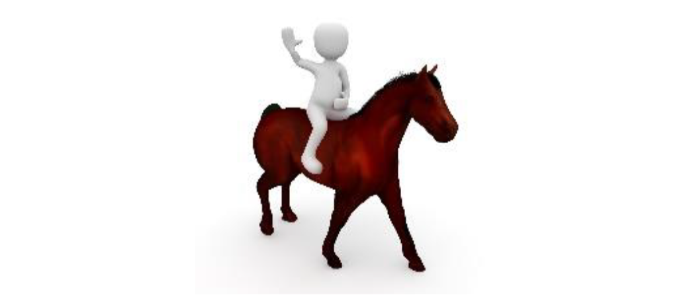
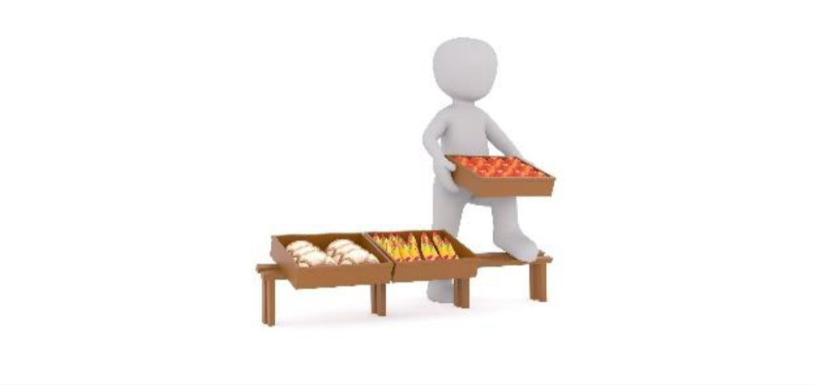
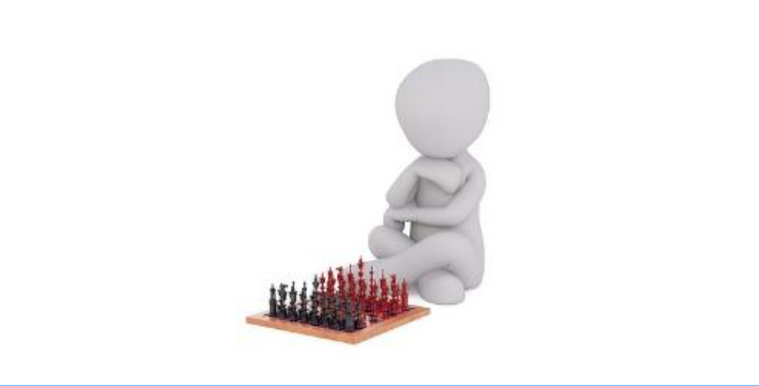
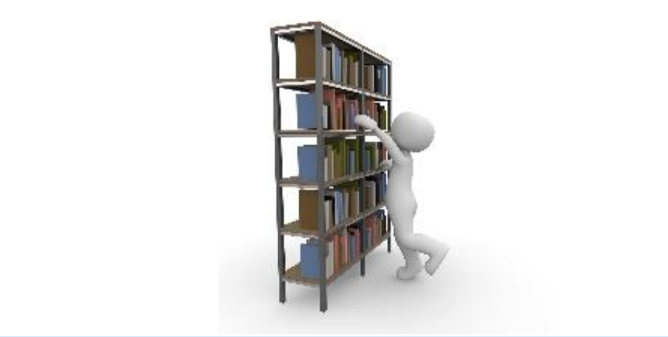
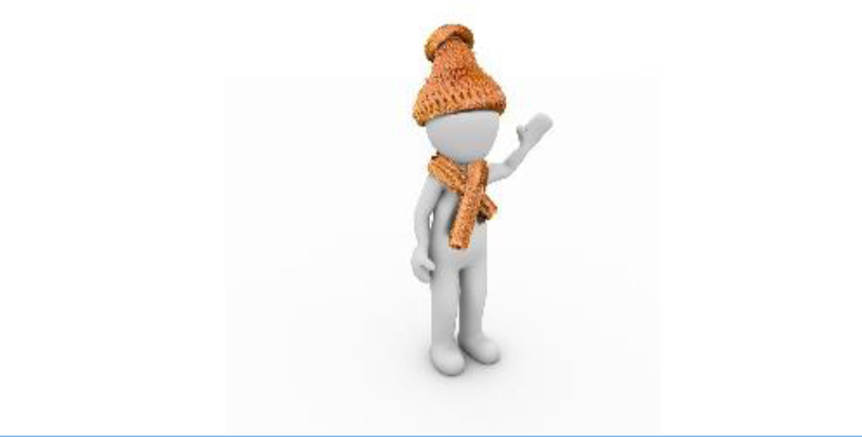

#List of irregular verbs

<table>
	<tr>
		<td width="35%" valign="top" style="background: white;">
		</img>
		</td>
		<td width="32%" valign="middle"  align="center" style="font-size: 140%!important; background: white;">
			begin
		</td>
		<td width="32%" valign="middle" align="center" style="font-size: 140%!important; background: white;">
		began
		</td>
	</tr>
	<tr>
		<td width="35%" valign="top" style="background: white;">
		</img>
		</td>
		<td width="32%" valign="middle"  align="center" style="font-size: 140%!important; background: white;">
			bring
		</td>
		<td width="32%" valign="middle" align="center" style="font-size: 140%!important; background: white;">
		brought
		</td>
	</tr>
	<tr>
		<td width="35%" valign="top" style="background: white;">
		</img>
		</td>
		<td width="32%" valign="middle" align="center" style="font-size: 140%!important; background: white;">
			build
		</td>
		<td width="32%" valign="middle" align="center" style="font-size: 140%!important; background: white;">
		built
		</td>
	</tr>
	<tr>
		<td width="35%" valign="top" style="background: white;">
		</img>
		</td>
		<td width="32%" valign="middle" align="center" style="font-size: 140%!important; background: white;">
			buy
		</td>
		<td width="32%" valign="middle" align="center" style="font-size: 140%!important; background: white;">
		bought
		</td>
	</tr>
	<tr>
		<td width="35%" valign="top" style="background: white;">
		</img>
		</td>
		<td width="32%" valign="middle" align="center" style="font-size: 140%!important; background: white;">
			catch
		</td>
		<td width="32%" valign="middle" align="center" style="font-size: 140%!important; background: white;">
		caught
		</td>
	</tr>
	<tr>
		<td width="35%" valign="top" style="background: white;">
		</img>
		</td>
		<td width="32%" valign="middle" align="center" style="font-size: 140%!important; background: white;">
			choose
		</td>
		<td width="32%" valign="middle" align="center" style="font-size: 140%!important; background: white;">
		chose
		</td>
	</tr>
		<tr>
		<td width="35%" valign="top" style="background: white;">
		</img>
		</td>
		<td width="32%" valign="middle" align="center" style="font-size: 140%!important; background: white;">
			drink
		</td>
		<td width="32%" valign="middle" align="center" style="font-size: 140%!important; background: white;">
		drank
		</td>
	</tr>
			<tr>
		<td width="35%" valign="top" style="background: white;">
		</img>
		</td>
		<td width="32%" valign="middle" align="center" style="font-size: 140%!important; background: white;">
			eat
		</td>
		<td width="32%" valign="middle" align="center" style="font-size: 140%!important; background: white;">
		ate
		</td>
	</tr>
				<tr>
		<td width="35%" valign="top" style="background: white;">
		</img>
		</td>
		<td width="32%" valign="middle" align="center" style="font-size: 140%!important; background: white;">
			give
		</td>
		<td width="32%" valign="middle" align="center" style="font-size: 140%!important; background: white;">
		gave 
		</td>
	</tr>
					<tr>
		<td width="35%" valign="top" style="background: white;">
		</img>
		</td>
		<td width="32%" valign="middle" align="center" style="font-size: 140%!important; background: white;">
			go
		</td>
		<td width="32%" valign="middle" align="center" style="font-size: 140%!important; background: white;">
		went 
		</td>
	</tr>
						<tr>
		<td width="35%" valign="top" style="background: white;">
		</img>
		</td>
		<td width="32%" valign="middle" align="center" style="font-size: 140%!important; background: white;">
			have
		</td>
		<td width="32%" valign="middle" align="center" style="font-size: 140%!important; background: white;">
		had 
		</td>
	</tr>
							<tr>
		<td width="35%" valign="top" style="background: white;">
		</img>
		</td>
		<td width="32%" valign="middle" align="center" style="font-size: 140%!important; background: white;">
			hold
		</td>
		<td width="32%" valign="middle" align="center" style="font-size: 140%!important; background: white;">
		held 
		</td>
	</tr>
								<tr>
		<td width="35%" valign="top" style="background: white;">
		</img>
		</td>
		<td width="32%" valign="middle" align="center" style="font-size: 140%!important; background: white;">
			know
		</td>
		<td width="32%" valign="middle" align="center" style="font-size: 140%!important; background: white;">
		knew 
		</td>
	</tr>
									<tr>
		<td width="35%" valign="top" style="background: white;">
		</img>
		</td>
		<td width="32%" valign="middle" align="center" style="font-size: 140%!important; background: white;">
			make
		</td>
		<td width="32%" valign="middle" align="center" style="font-size: 140%!important; background: white;">
		made 
		</td>
	</tr>
										<tr>
		<td width="35%" valign="top" style="background: white;">
		</img>
		</td>
		<td width="32%" valign="middle" align="center" style="font-size: 140%!important; background: white;">
			put
		</td>
		<td width="32%" valign="middle" align="center" style="font-size: 140%!important; background: white;">
		put 
		</td>
	</tr>
											<tr>
		<td width="35%" valign="top" style="background: white;">
		</img>
		</td>
		<td width="32%" valign="middle" align="center" style="font-size: 140%!important; background: white;">
			read
		</td>
		<td width="32%" valign="middle" align="center" style="font-size: 140%!important; background: white;">
		read 
		</td>
	</tr>
											<tr>
		<td width="35%" valign="top" style="background: white;">
		</img>
		</td>
		<td width="32%" valign="middle" align="center" style="font-size: 140%!important; background: white;">
			ride
		</td>
		<td width="32%" valign="middle" align="center" style="font-size: 140%!important; background: white;">
		rode 
		</td>
	</tr>
												<tr>
		<td width="35%" valign="top" style="background: white;">
		</img>
		</td>
		<td width="32%" valign="middle" align="center" style="font-size: 140%!important; background: white;">
			ring
		</td>
		<td width="32%" valign="middle" align="center" style="font-size: 140%!important; background: white;">
		rang 
		</td>
	</tr>
													<tr>
		<td width="35%" valign="top" style="background: white;">
		</img>
		</td>
		<td width="32%" valign="middle" align="center" style="font-size: 140%!important; background: white;">
			run
		</td>
		<td width="32%" valign="middle" align="center" style="font-size: 140%!important; background: white;">
		ran 
		</td>
	</tr>
													<tr>
		<td width="35%" valign="top" style="background: white;">
		</img>
		</td>
		<td width="32%" valign="middle" align="center" style="font-size: 140%!important; background: white;">
			sell
		</td>
		<td width="32%" valign="middle" align="center" style="font-size: 140%!important; background: white;">
		sold 
		</td>
	</tr>
													<tr>
		<td width="35%" valign="top" style="background: white;">
		</img>
		</td>
		<td width="32%" valign="middle" align="center" style="font-size: 140%!important; background: white;">
			send
		</td>
		<td width="32%" valign="middle" align="center" style="font-size: 140%!important; background: white;">
		sent 
		</td>
	</tr>
													<tr>
		<td width="35%" valign="top" style="background: white;">
		</img>
		</td>
		<td width="32%" valign="middle" align="center" style="font-size: 140%!important; background: white;">
			sing
		</td>
		<td width="32%" valign="middle" align="center" style="font-size: 140%!important; background: white;">
		sang 
		</td>
	</tr>
													<tr>
		<td width="35%" valign="top" style="background: white;">
		</img>
		</td>
		<td width="32%" valign="middle" align="center" style="font-size: 140%!important; background: white;">
			sit
		</td>
		<td width="32%" valign="middle" align="center" style="font-size: 140%!important; background: white;">
		sat 
		</td>
	</tr>
<tr>
		<td width="35%" valign="top" style="background: white;">
		</img>
		</td>
		<td width="32%" valign="middle" align="center" style="font-size: 140%!important; background: white;">
			stand
		</td>
		<td width="32%" valign="middle" align="center" style="font-size: 140%!important; background: white;">
		stood 
		</td>
	</tr>
<tr>
		<td width="35%" valign="top" style="background: white;">
		</img>
		</td>
		<td width="32%" valign="middle" align="center" style="font-size: 140%!important; background: white;">
			swim
		</td>
		<td width="32%" valign="middle" align="center" style="font-size: 140%!important; background: white;">
		swam 
		</td>
	</tr>
<tr>
		<td width="35%" valign="top" style="background: white;">
		</img>
		</td>
		<td width="32%" valign="middle" align="center" style="font-size: 140%!important; background: white;">
			speak
		</td>
		<td width="32%" valign="middle" align="center" style="font-size: 140%!important; background: white;">
		spoke 
		</td>
	</tr>
<tr>
		<td width="35%" valign="top" style="background: white;">
		</img>
		</td>
		<td width="32%" valign="middle" align="center" style="font-size: 140%!important; background: white;">
			think
		</td>
		<td width="32%" valign="middle" align="center" style="font-size: 140%!important; background: white;">
		thought 
		</td>
	</tr>
<tr>
		<td width="35%" valign="top" style="background: white;">
		</img>
		</td>
		<td width="32%" valign="middle" align="center" style="font-size: 140%!important; background: white;">
			take
		</td>
		<td width="32%" valign="middle" align="center" style="font-size: 140%!important; background: white;">
		took 
		</td>
	</tr>
<tr>
		<td width="35%" valign="top" style="background: white;">
		</img>
		</td>
		<td width="32%" valign="middle" align="center" style="font-size: 140%!important; background: white;">
			teach
		</td>
		<td width="32%" valign="middle" align="center" style="font-size: 140%!important; background: white;">
		taught 
		</td>
	</tr>
														<tr>
		<td width="35%" valign="top" style="background: white;">
		</img>
		</td>
		<td width="32%" valign="middle" align="center" style="font-size: 140%!important; background: white;">
			tell
		</td>
		<td width="32%" valign="middle" align="center" style="font-size: 140%!important; background: white;">
		told 
		</td>
	</tr>
<tr>
		<td width="35%" valign="top" style="background: white;">
		</img>
		</td>
		<td width="32%" valign="middle" align="center" style="font-size: 140%!important; background: white;">
			throw
		</td>
		<td width="32%" valign="middle" align="center" style="font-size: 140%!important; background: white;">
		threw 
		</td>
	</tr>
<tr>
		<td width="35%" valign="top" style="background: white;">
		</img>
		</td>
		<td width="32%" valign="middle" align="center" style="font-size: 140%!important; background: white;">
			wear
		</td>
		<td width="32%" valign="middle" align="center" style="font-size: 140%!important; background: white;">
		wore 
		</td>
	</tr>
<tr>
		<td width="35%" valign="top" style="background: white;">
		</img>
		</td>
		<td width="32%" valign="middle" align="center" style="font-size: 140%!important; background: white;">
			win
		</td>
		<td width="32%" valign="middle" align="center" style="font-size: 140%!important; background: white;">
		won 
		</td>
	</tr>
<tr>
		<td width="35%" valign="top" style="background: white;">
		</img>
		</td>
		<td width="32%" valign="middle" align="center" style="font-size: 140%!important; background: white;">
			write
		</td>
		<td width="32%" valign="middle" align="center" style="font-size: 140%!important; background: white;">
		wrote 
		</td>
	</tr>
</table>	

<a href="https://drive.google.com/file/d/1L0-dyHtLIT-JZYgmXfUwFi-N87wuZxd1/view?usp=sharing" target="_blank"><button type="button" class="btn btn-primary btn-lg">Download</button></a>

