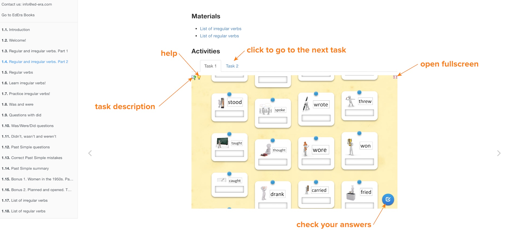

#Welcome!

  <!-- Nav tabs -->
  <ul class="nav nav-tabs" role="tablist">
    <li role="presentation" class="active"><a href="#home" aria-controls="home" role="tab" data-toggle="tab">About the project</a></li>
    <li role="presentation"><a href="#menu61" aria-controls="menu61" role="tab" data-toggle="tab">Contents</a></li>
    <li role="presentation"><a href="#menu62" aria-controls="menu62" role="tab" data-toggle="tab">About us</a></li>
    <li role="presentation"><a href="#menu64" aria-controls="menu64" role="tab" data-toggle="tab">How to use the platform</a></li>
  </ul>
  <!-- Tab panes -->
  

    

      <b><h3> align="center">Welcome to “Interactive English Grammar”!</h3> </b> <b>This project is:</b>
      <table style="border-spacing: 7px 11px;">
        <tr style="border-top: none;">
          <td width="40px" valign="middle" style="padding:0; border: none; background: white;">
            
          </td>
          <td valign="middle"  align="left" style="border: none; background: white;">
            <b>for all ages:</b> this course is for school and university students, adult learners and language teachers
          </td>
        </tr>
        <tr></tr>
        <tr style="border-top: none;">
          <td width="40px" valign="middle" style="padding:0; border: none; background: white;">
            
          </td>
          <td valign="middle"  align="left" style="border: none; background: white;">
            <b>practical:</b> use of tense is demonstrated through authentic videos
          </td>
        </tr>
        <tr style="border-top: none;">
          <td width="40px" valign="middle" style="padding:0; border: none; background: white;">
            
          </td>
          <td valign="middle"  align="left" style="border: none; background: white;">
            <b>detailed:</b> everything you need to master all aspects of the tense
          </td>
        </tr>
        <tr style="border-top: none;">
          <td width="40px" valign="middle" style="padding:0; border: none; background: white;">
            
          </td>
          <td valign="middle"  align="left" style="border: none; background: white;">
            <b>interactive:</b>  interactive videos and activities for maximum result
          </td>
        </tr>
        <tr style="border-top: none;">
          <td width="40px" valign="middle" style="padding:0; border: none; background: white;">
            
          </td>
          <td valign="middle"  align="left" style="border: none; background: white;">
            <b>fun:</b> practice grammar with songs, films, and online games
          </td>
        </tr>
      </table>
      <b>Each unit consists of: </b>
      <table>
        <tr style="border-top: none;">
          <td width="40px" valign="middle" style="padding:0; border: none; background: white;">
            
          </td>
          <td valign="middle"  align="left" style="border: none; background: white;">
            <b>extra materials:</b> the most important information in charts, tables and diagrams
          </td>
        </tr>
        <tr style="border-top: none;">
          <td width="40px" valign="middle" style="padding:0; border: none; background: white;">
            
          </td>
          <td valign="middle"  align="left" style="border: none; background: white;">
            <b>interactive videos:</b> watch and practice at the same time
          </td>
        </tr>
        <tr style="border-top: none;">
          <td width="40px" valign="middle" style="padding:0; border: none; background: white;">
            
          </td>
          <td valign="middle"  align="left" style="border: none; background: white;">
            <b>interactive activities:</b> games and tasks to help you practice everything you learn
          </td>
        </tr>
      </table>
    

    

      <ul>
        <li><a href="https://english2.ed-era.com/2/grease.html">Welcome!</a></li>
        <li><a href="https://english2.ed-era.com/2/regular-or-irregular-introduction.html">“We met. We kissed”. Past Simple verb. Part I</a></li>
        <li><a href="https://english2.ed-era.com/2/regular-or-irregular.html">“Summer nights” video-activity. Past Simple verb. Part II</a></li>
        <li><a href="https://english2.ed-era.com/2/regular-verbs-spelling.html">“He danced. She studied”. Regular verbs</a></li>
        <li><a href="https://english2.ed-era.com/2/learn.html">Irregular verbs: learn</a></li>
        <li><a href="https://english2.ed-era.com/2/practice.html">Irregular verbs: practice</a></li>
        <li><a href="https://english2.ed-era.com/2/was.html">“Those were the 1950s!”. Was and were</a></li>
        <li><a href="https://english2.ed-era.com/2/did.html">“What did you do all summer?”. Did questions</a></li>
        <li><a href="https://english2.ed-era.com/2/grease-questions.html">“Was it love at first sight?”. Was/Were/Did questions</a></li>
        <li><a href="https://english2.ed-era.com/2/didnt-wasnt.html">“Women didn’t wear jeans. Telephones weren’t private.” Didn’t, wasn’t and weren’t</a></li>
        <li><a href="https://english2.ed-era.com/2/talking-about-the-past.html">“The television revolution”. Past Simple questions</a></li>
        <li><a href="https://english2.ed-era.com/2/affirmative.html">“Danny and Sandy” video-activity. Past Simple mistakes</a></li>
        <li><a href="https://english2.ed-era.com/2/summary.html">The Making of “Grease”. Summary</a></li>
        <li><a href="https://english2.ed-era.com/2/CVC.html">Bonus 1. Past and Present </a></li>
        <li><a href="https://english2.ed-era.com/2/CVC-2.html">Bonus 2. The CVC rule</a></li>
        <li><a href="https://english2.ed-era.com/2/tablitsya_nepravilnih_diesliv.html">List of irregular verbs</a></li>
        <li><a href="https://english2.ed-era.com/2/tablitsya_pravilnih_diesliv.html">List of regular verbs</a></li>
      </ul>
    

    

      <table>
        <tr style="border-top: none;">
          <td width="165px" valign="middle" style="padding:0; border: none; background: white;">
            
          </td>
          <td valign="middle"  align="left" style="border: none; background: white;">
            <b>Christina Shabo</b> has been teaching English since 2011 and holds a Cambridge Certificate in English Language Teaching to Adults. She has worked with children and adults, groups and individual students from around the world. Christina’s favourite aspect of teaching English is grammar.  An avid supporter of E-learning technologies, she has always wanted to create course that would enable students to master grammar on their own and enjoy the process.
          </td>
        </tr>
        <tr style="border-top: none;">
          <td width="135px" valign="middle" style="padding:0; border: none; background: white;">
            
          </td>
          <td valign="middle"  align="left" style="border: none; background: white;">
            <b>EdEra</b> is an online-education studio. We create online-courses, interactive books, lesson scenarios, and models of intergation of modern educational solutions into the traditional educational process.</td>
        </tr>
      </table>
    

    

      <table>
        <tr style="border-top: none;">
          
<b>Here are some tips on how to use the platform:</b>

          
          
<b>How to use the activities:</b>

          
        </tr>
      </table>
    

  

