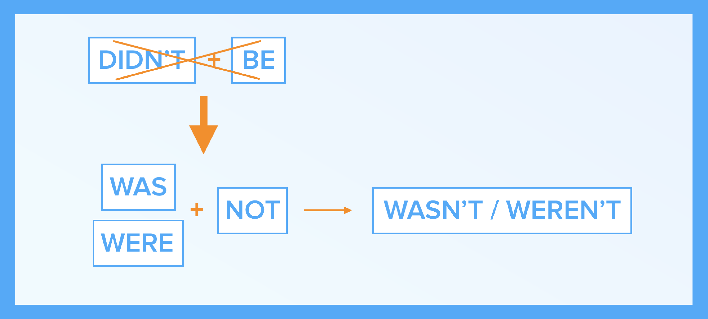

# Didn’t, wasn’t and weren’t

## “Women didn’t wear jeans. Telephones weren’t private.”

What inventions did people begin using in the 1950s?

In this unit you will:  

* learn some interesting facts about the 1950s
* practice using **didn’t** and **wasn’t**

### Materials

* [Table 1](didnt-wasnt.md#home)
* [Table 2](didnt-wasnt.md#menu41)

  

## Activities

* [Task 1](didnt-wasnt.md#home2)
* [Task 2](didnt-wasnt.md#menu51)

 \(function\($\) {window.fnames = new Array\(\); window.ftypes = new Array\(\);fnames\[0\]='EMAIL';ftypes\[0\]='email';fnames\[1\]='FNAME';ftypes\[1\]='text';fnames\[2\]='LNAME';ftypes\[2\]='text';}\(jQuery\)\);var $mcj = jQuery.noConflict\(true\); --&gt;  
  \#mc\_embed\_signup{background:\#fff; clear:left; font:14px Helvetica,Arial,sans-serif; width:100%;}  
  \#mc-embedded-subscribe{font-weight: 600; background-color:\#1b4880!important; text-transform: uppercase;}  
  \#mc-embedded-subscribe:hover{background-color:\#6292ea!important;}  
  /\* Add your own MailChimp form style overrides in your site stylesheet or in this style block.  
     We recommend moving this block and the preceding CSS link to the HEAD of your HTML file. \*/  
 Be the first to learn about new EdEra projects for learning English! Submit your email address and we will notify you! \(function\($\) {window.fnames = new Array\(\); window.ftypes = new Array\(\);fnames\[0\]='EMAIL';ftypes\[0\]='email';fnames\[1\]='FNAME';ftypes\[1\]='text';fnames\[2\]='LNAME';ftypes\[2\]='text';}\(jQuery\)\);var $mcj = jQuery.noConflict\(true\);

  
if \(document.readyState === "complete" \|\| document.readyState === "loaded"\) {  
  setTimeout\(function \(\) {  
      $\('\#menu51'\).css\('display', 'block'\);  
      setInterval\(function \(\) {  
          $\('\#menu51'\).css\('display', ''\);  
      }, 4000\);  
  }, 0\);  
} else {  
  document.addEventListener\('DOMContentLoaded', function\(\) {  
      setTimeout\(function \(\) {  
          $\('\#menu51'\).css\('display', 'block'\);  
          setInterval\(function \(\) {  
              $\('\#menu51'\).css\('display', ''\);  
          }, 4000\);  
      }, 0\);  
  }\);  
}  
if \(document.readyState === "complete" \|\| document.readyState === "loaded"\) {  
  setTimeout\(function \(\) {  
      $\('\#menu41'\).css\('display', 'block'\);  
      setInterval\(function \(\) {  
          $\('\#menu41'\).css\('display', ''\);  
      }, 4000\);  
  }, 0\);  
} else {  
  document.addEventListener\('DOMContentLoaded', function\(\) {  
      setTimeout\(function \(\) {  
          $\('\#menu41'\).css\('display', 'block'\);  
          setInterval\(function \(\) {  
              $\('\#menu41'\).css\('display', ''\);  
          }, 4000\);  
      }, 0\);  
  }\);  
}  

