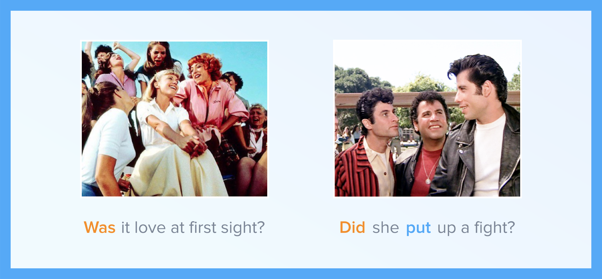

# Was/Were/Did questions

## “Was it love at first sight?”

Was it love at first sight?

In this video you will:

* listen to a song from the film “Grease” 
* look at the difference between **was** and **did** questions

### Materials

### Activity

* [Task 1](grease-questions.md#home)

 \(function\($\) {window.fnames = new Array\(\); window.ftypes = new Array\(\);fnames\[0\]='EMAIL';ftypes\[0\]='email';fnames\[1\]='FNAME';ftypes\[1\]='text';fnames\[2\]='LNAME';ftypes\[2\]='text';}\(jQuery\)\);var $mcj = jQuery.noConflict\(true\); --&gt;  
  \#mc\_embed\_signup{background:\#fff; clear:left; font:14px Helvetica,Arial,sans-serif; width:100%;}  
  \#mc-embedded-subscribe{font-weight: 600; background-color:\#1b4880!important; text-transform: uppercase;}  
  \#mc-embedded-subscribe:hover{background-color:\#6292ea!important;}  
  /\* Add your own MailChimp form style overrides in your site stylesheet or in this style block.  
     We recommend moving this block and the preceding CSS link to the HEAD of your HTML file. \*/  
 Be the first to learn about new EdEra projects for learning English! Submit your email address and we will notify you! \(function\($\) {window.fnames = new Array\(\); window.ftypes = new Array\(\);fnames\[0\]='EMAIL';ftypes\[0\]='email';fnames\[1\]='FNAME';ftypes\[1\]='text';fnames\[2\]='LNAME';ftypes\[2\]='text';}\(jQuery\)\);var $mcj = jQuery.noConflict\(true\);

