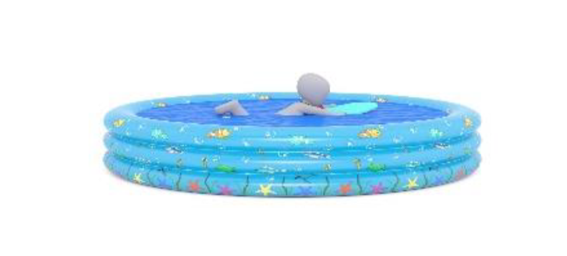
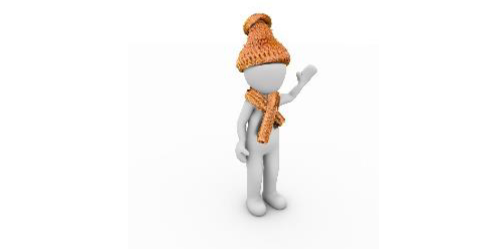
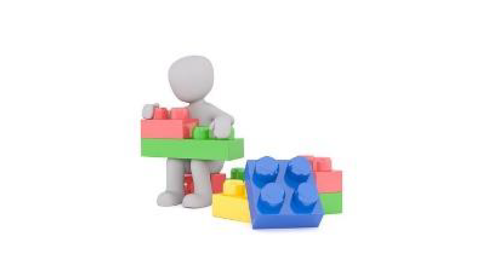

# Irregular verbs: learn

Here are materials and activities – everything you need to learn important irregular verbs!

* [Group 1](learn.md#home)
* [Group 2-3](learn.md#menu1)
* [Group 4](learn.md#menu2)
* [Group 5](learn.md#menu3)
* [Group 6](learn.md#menu4)

 i ⇒ a

|  |  beg**i**n |  beg**a**n |
| :--- | :--- | :--- |
|  |  dr**i**nk |  dr**a**nk |
|  |  g**i**ve |  g**a**ve |
|  |  s**i**ng |  s**a**ng |
|  |  sw**i**m |  sw**a**m |
|  |  r**i**ng |  r**a**ng |
|  |  s**i**t |  s**a**t |

[Activity 1](https://quizlet.com/302567712/write)

|  |  eat |  ate |
| :--- | :--- | :--- |
|  |  have |  had |
|  |  make |  made |

 o ⇒ e

|  |  g**o** |  w**e**nt |
| :--- | :--- | :--- |
|  |  h**o**ld |  h**e**ld |
|  |  kn**o**w |  kn**e**w |
|  |  thr**o**w |  thr**e**w |

[Activity 2-3](https://quizlet.com/302581153/write)

|  |  bring |  brought |
| :--- | :--- | :--- |
|  |  buy |  bought |
|  |  catch |  caught |
|  |  teach |  taught |
|  |  think |  thought |

[Activity 4](https://quizlet.com/302588327/write)

|  |  choose |  chose |
| :--- | :--- | :--- |
|  |  ride |  rode |
|  |  speak |  spoke |
|  |  wear |  wore |
|  |  win |  won |
|  |  write |  wrote |

[Activity 5](https://quizlet.com/302589457/write)

|  |  build |  built |
| :--- | :--- | :--- |
|  |  send |  sent |
|  |  read |  read |
|  |  run |  ran |
|  |  sell |  sold |
|  |  tell |  told |
|  |  stand |  stood |
|  |  take |  took |

[Activity 6](https://quizlet.com/302591717/write)
