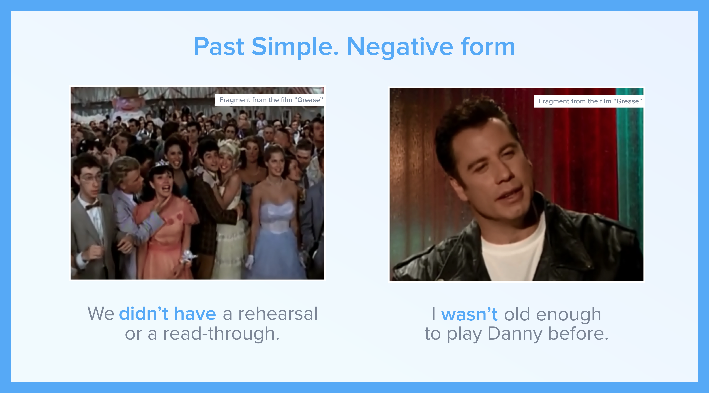
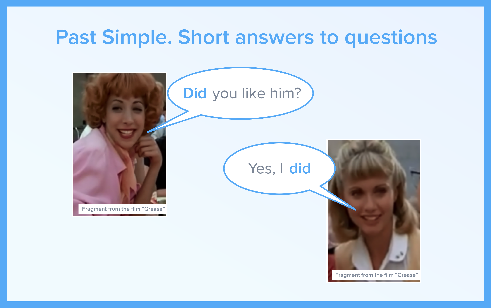

# Summary

## The Making of “Grease”

What do the actors from “Grease” say about the film?

In this video you will:

* listen to their  memories and experiences from making the film 
* check  how much you’ve learnt about Past Simpl

### Materials

* [Table 1](summary.md#home)
* [Table 2](summary.md#menu22)
* [Table 3](summary.md#menu23)
* [Table 4](summary.md#menu24)
* [Table 5](summary.md#menu25)
* [Table 6](summary.md#menu26)
* [Table 7](summary.md#menu27)

       

### Activities

* [Task 1](summary.md#home2)
* [Task 2](summary.md#menu1)

 \(function\($\) {window.fnames = new Array\(\); window.ftypes = new Array\(\);fnames\[0\]='EMAIL';ftypes\[0\]='email';fnames\[1\]='FNAME';ftypes\[1\]='text';fnames\[2\]='LNAME';ftypes\[2\]='text';}\(jQuery\)\);var $mcj = jQuery.noConflict\(true\); --&gt;  
  \#mc\_embed\_signup{background:\#fff; clear:left; font:14px Helvetica,Arial,sans-serif; width:100%;}  
  \#mc-embedded-subscribe{font-weight: 600; background-color:\#1b4880!important; text-transform: uppercase;}  
  \#mc-embedded-subscribe:hover{background-color:\#6292ea!important;}  
  /\* Add your own MailChimp form style overrides in your site stylesheet or in this style block.  
     We recommend moving this block and the preceding CSS link to the HEAD of your HTML file. \*/  
 Be the first to learn about new EdEra projects for learning English! Submit your email address and we will notify you! \(function\($\) {window.fnames = new Array\(\); window.ftypes = new Array\(\);fnames\[0\]='EMAIL';ftypes\[0\]='email';fnames\[1\]='FNAME';ftypes\[1\]='text';fnames\[2\]='LNAME';ftypes\[2\]='text';}\(jQuery\)\);var $mcj = jQuery.noConflict\(true\);

