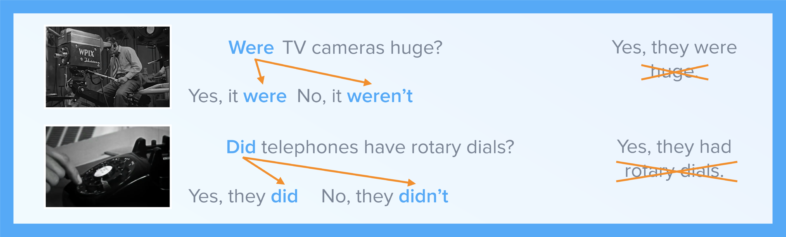

# Past Simple questions

## “The television revolution”

How was the world in the 1950s different from today?

In this video you will:

* learn about television in the 1950s
* practice asking and answering questions about the past.

### Materials

### Activities

* [Video-activity 1](talking-about-the-past.md#home)
* [Task 1](talking-about-the-past.md#menu1)
* [Video-activity 2](talking-about-the-past.md#menu10)
* [Task 2](talking-about-the-past.md#menu3)
* [Video-activity 3](talking-about-the-past.md#menu11)
* [Task 3](talking-about-the-past.md#menu5)

